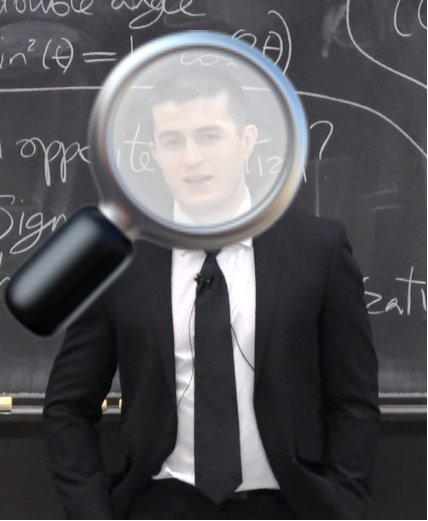

# lexisearch

<p align="center">
  
</p>

Use semantic similarity models to query transcriptions from the [Lex Fridman Podcast](https://lexfridman.com/podcast/).

Transcriptions were obtained from [lexicap](https://karpathy.ai/lexicap/) using [Whisper](https://github.com/openai/whisper).

Inspired by: https://www.youtube.com/watch?v=vpU_6x3jowg

## HOWTO

Install the requirements:

`pip install -r requirements.txt`

Create the dataset used to build the index:

`python create_dataset.py`

Build and save the index:

`python create_index.py`

Afterwards, the index can be queried with, e.g.:

`python query_index.py --query "What is the meaning of life?"`

This will get the top five most semantically similar transcription windows, along with links to the podcast episode on YouTube at those timestamps.

```markdown
title: John Abramson: Big Pharma | Lex Fridman Podcast #263
transcript: [02:14:40] But what do you think is the meaning of life, of our human existence? I think it's to care about something and do your best with it. Whether it's being a doctor and trying to make sure that the greatest number of people get the best health care.
link: https://youtu.be/arrokG3wCdE?t=8080
**********
title: Matthew Johnson: Psychedelics | Lex Fridman Podcast #145
transcript: [03:28:46] Like, I don't know, the meaning, I think the meaning of life is to find meaning. And I think, actually, I think I just described it a minute ago. It's like that transcendence of everything. Like, it's the beauty despite the absolute ugliness. It's the, and as a species, and I think more about this,
link: https://youtu.be/ICj8p5jPd3Y?t=12526
**********
title: Matt Walker: Sleep | Lex Fridman Podcast #210
transcript: [02:46:00] Do you think there's a meaning? Do you think there's a answer to the why? For me personally, I think the meaning of life is to eat, is to sleep, is to fall in love, is to cry, and then to die.
link: https://youtu.be/Hc4XvHTlW3s?t=9960
**********
title: Lisa Feldman Barrett: Counterintuitive Ideas About How the Brain Works | Lex Fridman Podcast #129
transcript: [02:16:47] But for me, I would say sometimes the meaning of life is to understand, to make meaning actually. The meaning of life is to make meaning. Sometimes it's that. Sometimes it's to leave the world just slightly a little bit better
link: https://youtu.be/NbdRIVCBqNI?t=8207
**********
title: Steven Pinker: AI in the Age of Reason | Lex Fridman Podcast #3
transcript: [00:00:16] What is the meaning of life? Is it A. to attain knowledge as Plato said, B. to attain power as Nietzsche said, C. to escape death as Ernest Becker said, D. to propagate our genes as Darwin and others have said, E. there is no meaning as the nihilists have said, F. knowing the meaning of life is beyond our cognitive capabilities as Stephen Pinker said, based on my interpretation 20 years ago, and G. none of the above.
link: https://youtu.be/epQxfSp-rdU?t=16
**********
```
